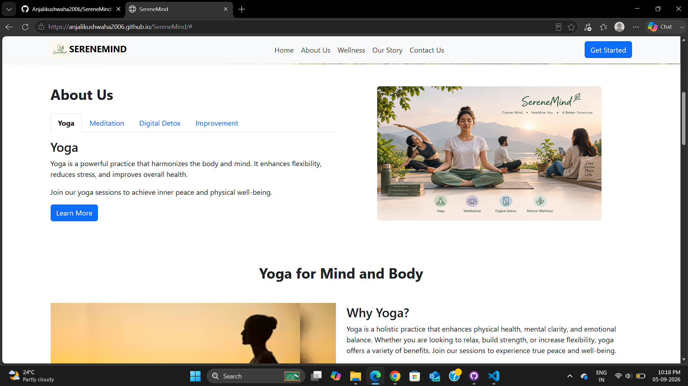

# 🌿 SereneMind — Healthcare & Wellness Website

SereneMind is a responsive healthcare and wellness website designed to encourage healthy habits and promote mental and physical well-being.

## 🌐 Live Demo

https://anjalikushwaha2006.github.io/SereneMind/

## 📸 Project Preview

## ✨ Features

- Responsive navigation bar
- Hero image carousel
- Yoga, Meditation and Digital Detox sections
- Wellness information and health stories
- Responsive design using Bootstrap 5
- Contact form with JavaScript validation/demo submission
- Mobile-friendly layout
- Smooth navigation between sections

## 🛠️ Technologies Used

- HTML5
- CSS3
- JavaScript
- Bootstrap 5
- Bootstrap Icons

## 📂 Project Structure

SereneMind/
├── css/
│   └── style.css
├── images/
├── index.html
├── script.js
└── README.md

## 🚀 How to Run Locally

1. Clone the repository.
2. Open the project folder.
3. Open `index.html` in a web browser.

## 🎯 Learning Outcomes

Through this project, I practiced:

- Building responsive websites
- Using Bootstrap components
- Structuring webpages with HTML
- Styling interfaces with CSS
- Adding basic interactivity using JavaScript
- Managing project files using Git and GitHub
- Deploying a website using GitHub Pages

## 👩‍💻 Author

Anjali Kushwaha
